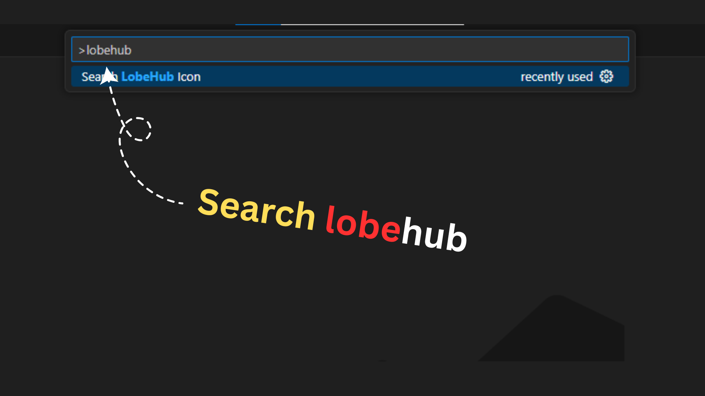

  
  <h1>lobehub-icon-helper</h1>
  
Easily browse, search, and insert LobeHub icons into your projects without leaving the editor.

`lobehub-icon-helper` is a Visual Studio Code extension that helps you easily browse, search, and insert **LobeHub icons** into your projects without leaving the editor.

---

## ✨ Features

- 🔍 **Search Icons** – Quickly find icons from the LobeHub icon set.
- 📋 **Copy/Insert Icons** – Copy SVG code or insert directly into your project.
- 🎨 **Preview Support** – Instantly preview icons before using them.
- ⚡ **Fast & Lightweight** – Built for speed with minimal overhead.

---

## ⚙️ Requirements

- Visual Studio Code `1.85.0` or higher
- Internet access (for fetching icon metadata)

---

## 🚀 How to Use

**1. Why bother searching for icons online?**

This extension brings the entire LobeHub icon library directly into your VS Code editor, streamlining your workflow.

**2. Open Visual Studio Code**

First, open your Visual Studio Code editor.

**3. Click on the Extensions icon**

In the Activity Bar on the side of the window, click on the Extensions icon.

**4. Search for `lobehub-icon-helper`**

In the search bar of the Extensions view, type `lobehub-icon-helper` and press Enter.

**5. Install the extension**

Click the "Install" button to install the `lobehub-icon-helper` extension.

**6. Open the Command Palette**

Press `Ctrl+Shift+P` (or `Cmd+Shift+P` on Mac) to open the Command Palette.

**7. Search for "LobeHub"**

In the Command Palette, type "LobeHub" to see the available commands for the extension and select the option to open the icon helper.

**8. Type the icon name**

Use the search bar within the extension's panel to find the icon you need by typing its name.

**9. Insert the icon**

Double-click on the desired icon. The icon will be automatically downloaded and a new file will be created in an `icons` folder within your project's root directory.

---

## 🔧 Extension Settings

This extension contributes the following settings:

- `lobehubIconHelper.enable`: Enable/disable the extension.
- `lobehubIconHelper.defaultFormat`: Choose default format (`svg`, `jsx`, `iconfont`).
- `lobehubIconHelper.insertMode`: Select whether to insert as inline SVG or component import.

---

## 🐞 Known Issues

- Limited to the official **LobeHub icon set**.
- Some icons may not display correctly in preview on certain themes.

---

## 📦 Release Notes

### 1.1.0

- Added preview panel for icons.
- New configuration for default format.

### 1.0.0

- Initial release of **lobehub-icon-helper** 🎉
- Icon search and insertion support.

---

## 📖 Resources

*(You can add links to your GitHub repository, documentation, or other relevant resources here.)*

---

**Enjoy effortless icon management with LobeHub Icon Helper!** 🎨
